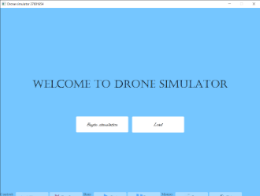
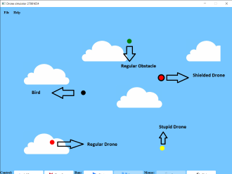
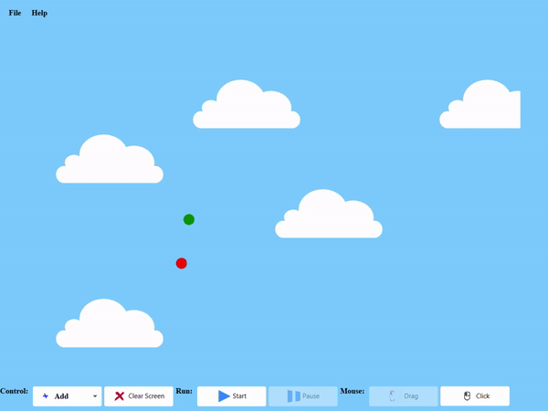
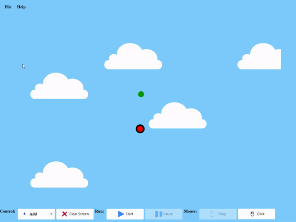
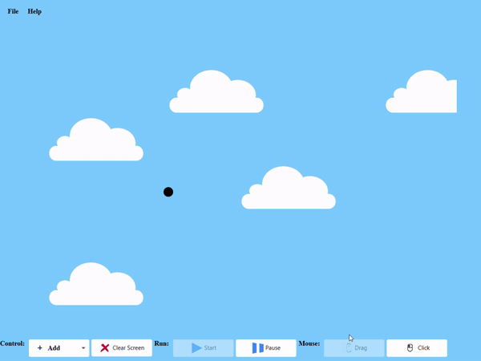

# Drone Simulator
Drone simulator is a project i created as part of an assignment in my second year in
university. It uses JavaFX to create the GUI, and basically the application has different 
types of drones (circles with different colors) and different objects. Its drone acts
differently when interacting with an object.

## Drone Types
In this section i will go over all the drone types that exist in the application

### Regular Drone - Red
A regular drone is a drone that avoid all the obstacles by moving to the direction that is easier to avoid the obstacle and then 
returning to its normal course

### Stupid Drone - Yellow
A stupid drone is a drone that when it hits an obstacle, destroys itself and the obstacle

### Shielded Drone - Red with a black circle around it
A shielded drone is a drone that has a shield around it (obviously), and when it hits
an obstacle, it destroys the obstacle and becomes a regular drone.

## Obstacle Types
In this section i will go over the two types of obstacles

### Regular obstacle
A regular obstacle is an obstacle that does not move around on the map. It gets destroyed
when a stupid, or a shielded drone bumps into it.

### Bird
A bird is an obstacle that appears randomly in a place in the arena.

